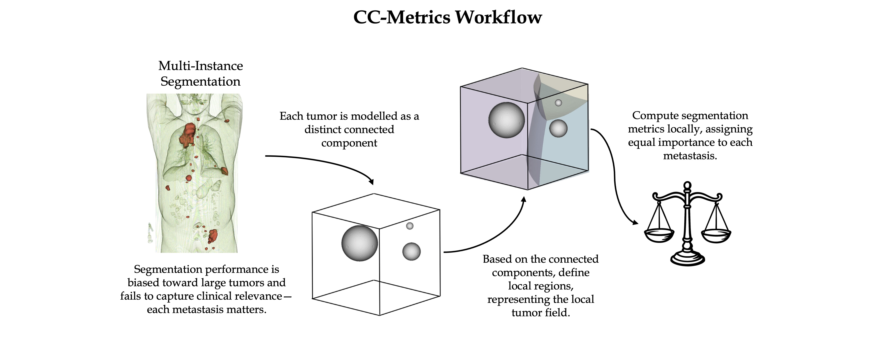

# CC-Metrics
## Every Component Counts: Rethinking the Measure of Success for Medical Semantic Segmentation in Multi-Instance Segmentation Tasks

[](https://arxiv.org/pdf/2410.18684) [](LICENSE)

## Description
CC-Metrics is an evaluation approach for assessing standard evaluation metrics such as Dice or Surface-Dice on a per-connected component basis. To determine how to match predictions to ground-truth connected components, it separates the image space into Voronoi regions and maps predictions within the Voronoi region to the corresponding ground-truth.

Below is an example visualization of the Voronoi-based mapping process:

<div align="center">
  
</div>

For more details, you can read the full paper [here](https://arxiv.org/pdf/2410.18684).

## Table of Contents

- [Description](#description)
- [Installation](#installation)
- [How to use CC-Metrics](#how-to-use-cc-metrics)
  - [Basic Usecase](#basic-usecase)
  - [Metric Aggregation](#metric-aggregation)
  - [Caching mechanism](#caching-mechanism)
- [Citation](#citation)
- [License](#license)

## Installation

The project is available in PyPI. To install, run:

```pip install ccmetrics```

or perform a local installation.

## How to use CC-Metrics
CC-Metrics defines a wrapper around Monai's Cumulative metrics. 

#### Basic Usecase

```python
from CCMetrics import CCDiceMetric

cc_dice = CCDiceMetric(
                       cc_reduction="patient",
                       use_caching=True, 
                       caching_dir=".cache"
                       )

y, y_hat = torch.rand((1, 2, 200, 200, 200)), torch.rand((1, 2, 200, 200, 200))
# Tensors are expected in shape (B, C, D, H, W)

cc_dice(y_pred=y_hat, y=y)

ccdice.cc_aggregate()
```
Explored metrics in the paper include 
- CCDiceMetric
- CCHausdorffDistanceMetric
- CCHausdorffDistance95Metric
- CCSurfaceDistanceMetric
- CCSurfaceDiceMetric

Unbounded metrics require specifying a worst-case value to replace infinity or NaN, as in

```CCSurfaceDistanceMetric(cc_reduction="overall",  metric_worst_score=30)``` 

This is necessary, as averaging these metrics would otherwise be undefined.

#### Metric Aggregation

The `CCBaseMetric` class supports two types of metric aggregation modes:

1. **Patient-Level Aggregation (`patient`)**: 
  - Computes the mean metric score for each patient by aggregating all connected components within the patient.
  - Returns a list of mean scores, one for each patient.

2. **Overall Aggregation (`overall`)**:
  - Treats all connected components across all patients equally.
  - Aggregates the metric scores for all components into a single list.

The aggregation mode can be specified using the `cc_aggregate` method, with the default mode being `patient`.

#### Caching mechanism
CC-Metrics requires the computation of a generalized Voronoi diagram which serves as the mapping mechanism between predictions and ground-truth. As the separation of the image space only depends on the ground-truth, the mapping can be cached and reused between intermediate evaluations or across metrics. Even computed in advance to speed up the metric computation. 

Use the ```use_caching``` flag and provide a caching location. This will compute and cache the voronoi regions when they are computed for the first time. It is recommended to precache these regions allowing for a faster computation on the spot. This can be achieved using the 
```prepare_caching.py``` script that computes and caches voronoi regions for all ```.nii.gz```images in a given directory.

```
python prepare_caching.py --gt <Ground truth directory> --cache_dir <caching directory>  --nof_workers <NOF of parallel workers>
```


## Citation

If you make use of this project in your work, it would be appreciated if you cite the cc-metrics paper
```
@article{jaus2024every,
  title={Every Component Counts: Rethinking the Measure of Success for Medical Semantic Segmentation in Multi-Instance Segmentation Tasks},
  author={Jaus, Alexander and Seibold, Constantin and Rei{\ss}, Simon and Marinov, Zdravko and Li, Keyi and Ye, Zeling and Krieg, Stefan and Kleesiek, Jens and Stiefelhagen, Rainer},
  journal={arXiv preprint arXiv:2410.18684},
  year={2024}
}
```

## License

This project is licensed under the [Apache 2.0 License](LICENSE).

